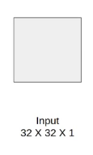
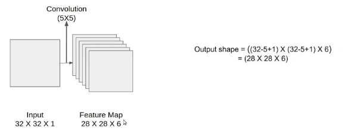
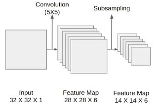
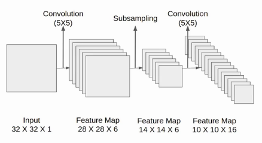

<div align="center">
<h1>
Minimal PyTorch implementation of LeNet5
</h1>

</div>

### LeNet5

LeNet5 is a convolutional neural network, also known as Multi-Layer Perceptron.

### Installing the model
```
pip install -r requirements.txt
```

### Training the model
```
python train.py
```

### Testing the model
```
python test.py
```

### Architecture

The network has 5 layers with learnable parameters and hence named Lenet-5. 



The input to this model is a 32 X 32 grayscale image hence the number of channels is one.



We then apply the first convolution operation with the filter size 5X5 and we have 6 such filters. As a result, we get a feature map of size 28X28X6. Here the number of channels is equal to the number of filters applied..



We then apply the first convolution operation with the filter size 5X5 and we have 6 such filters. As a result, we get a feature map of size 28X28X6. Here the number of channels is equal to the number of filters applied.



Next, we have a convolution layer with sixteen filters of size 5X5. Again the feature map changed it is 10X10X16. The output size is calculated in a similar manner. After this, we again applied an average pooling or subsampling layer, which again reduce the size of the feature map by half i.e 5X5X16.


Then we have a final convolution layer of size 5X5 with 120 filters. As shown in the above image. Leaving the feature map size 1X1X120. After which flatten result is 120 values.

After these convolution layers, we have a fully connected layer with eighty-four neurons. At last, we have an output layer with ten neurons since the data have ten classes.


Here is the final architecture of the Lenet-5 model.
 
    * Input: 32x32x1 grayscale image
    * Conv1: 5x5 convolution, 6 outputs (28x28x6)
    * Pool1: 2x2 pooling, outputs (14x14x6)
    * Conv2: 5x5 convolution, 16 outputs (10x10x16)
    * Pool2: 2x2 pooling, outputs (5x5x16)
    * FC1: 120 outputs (1x1x120)
    * FC2: 84 outputs (1x1x84)
    * Output: 10 outputs (1x1x10)

References:
- [LeNet5](https://www.datasciencecentral.com/lenet-5-a-classic-cnn-architecture/)
- [Paper](http://vision.stanford.edu/cs598_spring07/papers/Lecun98.pdf)